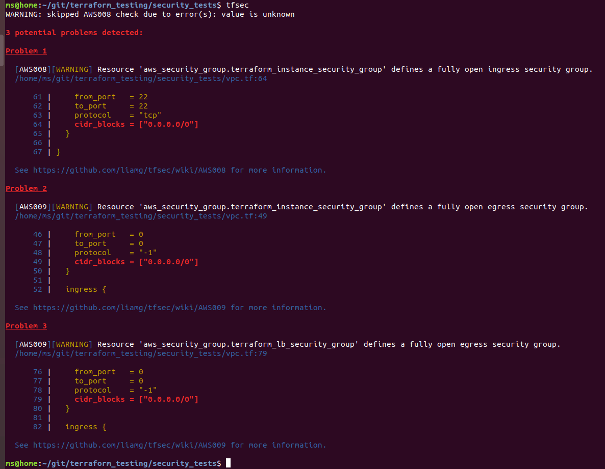
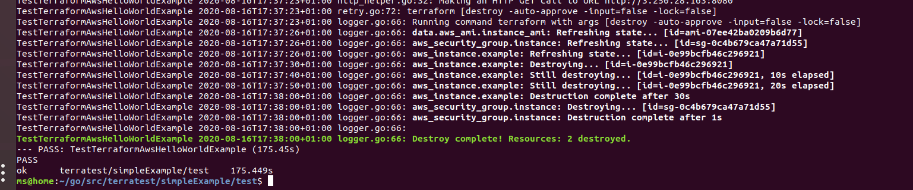

# terraform_testing
A repo to demonstrate testing within Terraform. Within this page we will look at several classifications of testing.
While some of these definitions may be disputed, it is important to take the value from each of the sections. 
By doing so, you can be more confident in your code/infrastructure.

Within this document I aim to quickly outline some different forms of testing your Terraform code:
- Static testing/ analyses 
- Linters
- Security testing
- Unit testing
- Integration testing
- Property testing
- E2E Testing


## Static Testing/Analysis

**What is Static testing?**

Static testing is a software testing technique by which we can check the defects in software 
without actually executing it. 


What are the benefits of static testing/analysis
- Fast.
- Stable.
- No need to deploy resources.
- Very easy to use.


In our case, for our static analysis we will make use of a native Terraform command - `terraform validate`.
This will allow for a quick check to make sure you have not made a silly mistake with spelling, missing a bracket, or what I
believe to be more useful; checking for unused variables.

All you will need to do here is run your terraform validate command in your code DIR.
`terraform validate -json`

A common example for errors that can be easily found is duplication. Within the static_analysis section I have copied some code from the TF website.

I have followed a standard of creating a `proivider.tf` file to store any provider information:


```yaml
provider "aws" {
  access_key = var.AWS_ACCESS_KEY_ID
  secret_key = var.AWS_SECRET_ACCESS_KEY
  region     = var.region
  version    = "~> 2.56"
}
```

However I have also copied code that already has a provider block nested within it, and I have added that to my `main.tf` file. If I run a validate command, this is clear.

```
$ terraform validate

Error: Duplicate provider configuration

  on provider.tf line 1:
   1: provider "aws" {

A default (non-aliased) provider configuration for "aws" was already given at
main.tf:3,1-15. If multiple configurations are required, set the "alias"
argument for alternative configurations.
```


**Pre-requirements:** 

- Just have TF installed.

**Links:**

[Terraform Validate](https://www.terraform.io/docs/commands/validate.html)


## Linters 

**What is a Linter?**
A linter is simply a tool that can be used to analyse code for programmatic or stylistic errors.
Although a linter is also another form of static analysis, for the purposes of this document, I wanted to keep them
separate to give an easier way to break down these sections.

If you are running on a Linux bsaed OS, you can install `tflint` easily with the following curl command:
`curl -L "$(curl -Ls https://api.github.com/repos/terraform-linters/tflint/releases/latest | grep -o -E "https://.+?_linux_amd64.zip")" -o tflint.zip && unzip tflint.zip && rm tflint.zip` 

After doing this, you will be able to run `tflint` in the needed DIR.

Linters can pick up errors that would otherwise not be picked up by other methods of static testing.
An example of this would be for provider specific fields/resources, this can be shown with the below example.


```yaml
resource "aws_instance" "testing" {
  ami           = "ami-0ff8a91507f77f867"
  instance_type = "t1.2xlarge" # invalid type!
}
```
If we do some static testing on this code - like `terraform validate`:

```
$ terraform validate 
Success! The configuration is valid.
```

If we run our linter: 
```
$ ./tflint 
1 issue(s) found:

Error: "t1.2xlarge" is an invalid value as instance_type (aws_instance_invalid_type)

  on main.tf line 3:
   3:   instance_type = "t1.2xlarge" # invalid type!
```

You can see that our linter finds the issue before having to attempt to run a `terraform plan`.
Static testing combined with linting is a great way to test without having to create any infrastructure.
These are ideal steps to include before committing to your SCM, and should be considered mandatory.


**Pre-requirements:** 

- Install `tflint`
  
**Links:**

https://github.com/terraform-linters/tflint


## Security Testing

**What security aspects are we looking for?** 
There are many benefits to infrastructure as code, it can allow someone to create a complex network, spanning data centers, regions and subnets. One of the most common issues when starting to create resources in the cloud is that you expose your instances/hosts to the outside world. This is one of many security issues we want to check before deploying our code.

`tfsec` is another tool we can use for static security analysis.
If you check the `README.md` you will find that there is a large number of potential security flaws you can be alerted too, before applying and building your infrastructure. 

In the below image you can see that `tfsec` find 3 sections within my code that has a fully open ingress security group.
This is a common mistake that many make, this is partly due to the fact they have not set up correct routing to their instances.  

Again `tfsec` is yet another form of static analysis, as aforementioned, I wanted to keep them
separate to give an easier way to break down these sections.




**Pre-requirements:** 
- Have GO installed. Use a version that is appropriate.
- Make sure you have your variabes exported. Check the GOlang docs for insall info.
```bash
# Export ENV variables (make sure you update with your own path)
export GOROOT=/usr/local/go
export GOPATH=$HOME/go
export PATH=$GOPATH/bin:$GOROOT/bin:$PATH

# You could also update your bashrc - .profile.


# VALIDATE WITH
go version
go env
```

- Install `tfsec`
  - When go is installed you can run - `go get -u github.com/liamg/tfsec/cmd/tfsec`


**Links:**

https://github.com/liamg/tfsec
https://golang.org/dl/


## Unit Testing

**What is a Terraform Unit Test?**

Within Terraform, a unit test can be simplified to a Terraform module. Unit tests can be used as a way to build confidence on a small,and logical grouping of your code - a unit.

The reason unit testing can be difficult in Terraform, is because Terraform is full of dependencies.
Think about a basic usecase of creating a EC2 instance on AWS. You are using a AWS provider, you are reliant on AWS's API's.
This is the reason that you will need to deploy your resources to test them, you cannot do this statically. This is part of a reason that many will find it hard to describe unit tests in Terraform.

Many people would say that there are only integration tests in Terraform for the aforementioned reason - you are always reliant, or integrated with other units/groups of code.

Good things about unit tests:
- Still pretty quick - generally under 10 mins.
- Mostly stable.
- Gives a high level of confidence in an individual units.

Weaknesses of unit tests:
- You need to deploy your resources.
- Requires you to write non-trivial code. 

`Terratest` is a very popular tool that can be used to help write unit tests. 
Terratest is a Go library that makes it easier to write automated tests for your infrastructure code. It provides a variety of helper functions and patterns for common infrastructure testing tasks.

Every team can make use of unit testing with `Terratest`, it is very easy when people are early on, in their IaC journey, as you are more likely to only have a few modules that you can test.  

I have provided a basic example of code that can be used within the `unit_testing` folder.
This code will create a EC2 instance and write 'hello world' on a web server. The unit test will look for the connection and check that the body says 'Hello, World!'

There is a huge about of information on Terratest - go have a look.


**Tools:**

- Terratest

**Pre-requirements:** 

There is some go setup:

GO can be a bit annoying. Many experience errors relating to path and dependency errors.
I think after getting GO installed, you want to create projects within your GO path /src dir.
Note: I have a terratest project and then nest my code into `test` and `tfcode` DIRs. Feel free to nest your directories 
as you see fit.

My code was nested like:
```
/home/ms/go/src/terratest
└── simpleExample
    ├── test
    │   ├── go.mod
    │   ├── go.sum
    │   └── terraform_basic_example_test.go
    └── tfcode
        ├── main.tf
        ├── provider.tf
        ├── terraform.tfstate
        ├── terraform.tfstate.backup
        ├── terraform.tfvars
        ├── variables.tf
        └── versions.tf

3 directories, 10 files
```

When it comes to testing you can do an init (like a `dep ensure`), then run the test:
```
$ go mod init github.com/mSm1th/terraform_testing
go: creating new go.mod: module github.com/mSm1th/terraform_testing
$ go test -v 
```

Hopefully your tests pass:



**Links:**
- https://terratest.gruntwork.io/docs/getting-started/introduction/#introduction
- https://terratest.gruntwork.io/docs/getting-started/quick-start/
- https://golang.org/doc/install


## Integration Testing

**What is a Terraform Integration Test?**

Integration tests within Terraform are tests the utilise multiple modules, that work together, some of which may have dependencies on each other.

What are the benefits of integration testing
- Mostly stable (with retry logic)
- You have a high confidence in individual units working together.

**Remember - integration testing will also mean you have to provision the resources!**


An example; you may have some code that looks to deploy instances on AWS.

You create a `VPC` module as well as a `instance` module.
The `VPC` will be created before you provision the instances within the created VPC. 

Therefore, the integration test would be that 


**Tools:**
**Pre-requirements:** 
**Links:**

## Property Testing

**What is a Property/properties Test?**

**Tools:**
**Pre-requirements:** 
**Links:**

## E2E Testing

E2E testing in Terraform is ......

**Tools:**
**Pre-requirements:** 
**Links:**

--- 
